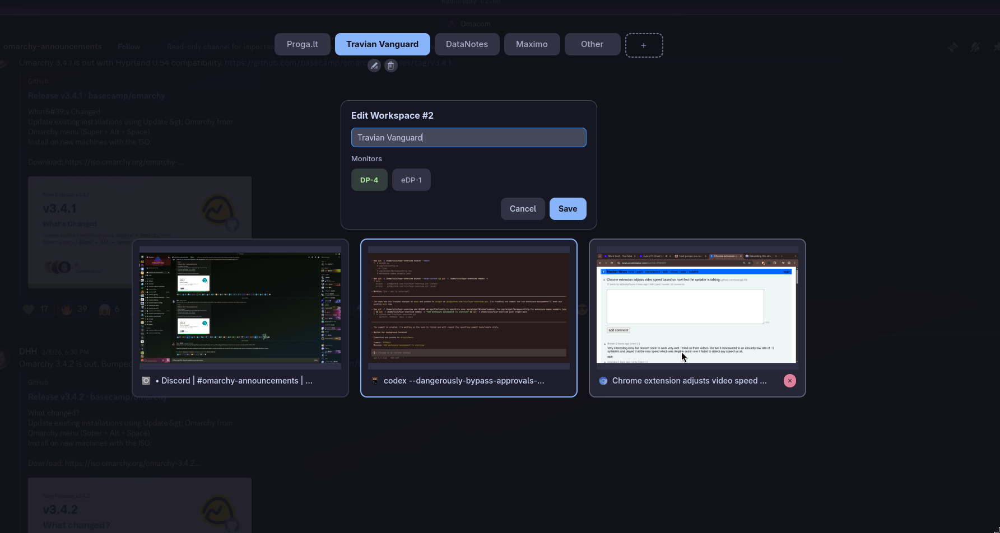

# hypr-overview

An AGS overview for Hyprland with live window thumbnails backed by a small Rust Wayland helper.

It is split into two parts:

- `ags/`: the AGS widgets, runtime glue, and SCSS
- `native/hypr-overviewd/`: a helper that captures per-window frames into shared memory-backed files under `XDG_RUNTIME_DIR`

This avoids the `grim -> image file -> decode every frame` loop that falls over once you have more windows on screen.

## Preview



## What It Does

- `Super+Tab`-style overview overlay
- live per-window previews
- workspace strip with create, edit, delete, and drag-reorder support
- drag a window onto a workspace pill to move it there
- persistent workspace names, ordering, and monitor assignments

## Requirements

- Hyprland
- AGS v2 with GTK4
- `AstalHyprland`
- Rust toolchain
- Wayland compositor support for:
  - `ext_foreign_toplevel_list_v1`
  - `ext_image_capture_source_v1`
  - `ext_image_copy_capture_v1`

This was built against Hyprland and AGS on Linux. It is not meant for X11.

## Repo Layout

```text
ags/
  lib/
  run-ags-service.sh
  widget/
  style.scss
native/
  hypr-overviewd/
  run-hypr-overviewd.sh
systemd/
  ags.service
  hypr-overviewd.service
workspace-names.example.json
```

## Install

Copy the AGS files into your config:

```text
ags/widget/Overview.tsx
ags/widget/WorkspaceStrip.tsx
ags/widget/WindowGrid.tsx
ags/widget/WindowThumbnail.tsx
ags/lib/overviewd.ts
ags/lib/config.ts
ags/run-ags-service.sh
ags/style.scss
```

Build the helper:

```bash
cd native/hypr-overviewd
cargo build --release
```

Install the user service:

```bash
mkdir -p ~/.config/systemd/user
cp systemd/hypr-overviewd.service systemd/ags.service ~/.config/systemd/user/
systemctl --user daemon-reload
systemctl --user enable --now ags.service
systemctl --user enable --now hypr-overviewd.service
```

If you keep the helper inside your AGS config, the wrapper script can build it on demand:

```bash
native/run-hypr-overviewd.sh
```

Create `~/.config/ags/workspaces.json` if you want persistent workspace metadata:

```bash
cp workspace-names.example.json ~/.config/ags/workspaces.json
```

## AGS Wiring

Register the overview window in your AGS app and bind it to a key in Hyprland, for example:

```ini
bind = SUPER, TAB, exec, ags toggle overview
```

Your AGS app needs to include the `Overview` widget. The implementation in `ags/widget/Overview.tsx` expects the window to be named `overview`.

The helper should not be launched from Hyprland `exec-once` if you are using the systemd user service.
AGS should also not be launched from Hyprland `exec-once` if you are using `ags.service`.

## Notes

- The helper watches `targets.json` under `XDG_RUNTIME_DIR/hypr-overviewd/` and only captures windows AGS asks for.
- The AGS side reads raw frame metadata and renders it from mapped bytes via `GdkPixbuf`.
- Workspace metadata is stored in `~/.config/ags/workspaces.json`.

## Limitations

- This is Hyprland-specific in practice.
- The helper currently uses a polled `targets.json` control file instead of a socket.
- It assumes the compositor exposes stable toplevel identifiers through Hyprland client metadata.

## Development

Helper:

```bash
cd native/hypr-overviewd
cargo run
```

AGS:

```bash
ags run
```
